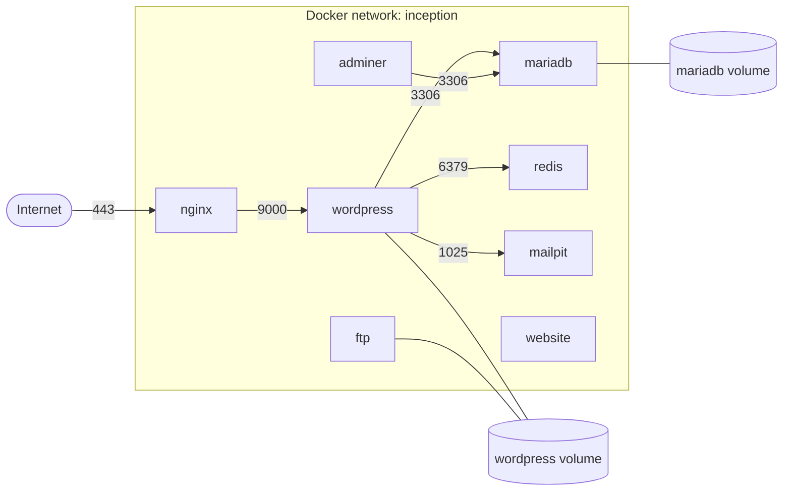
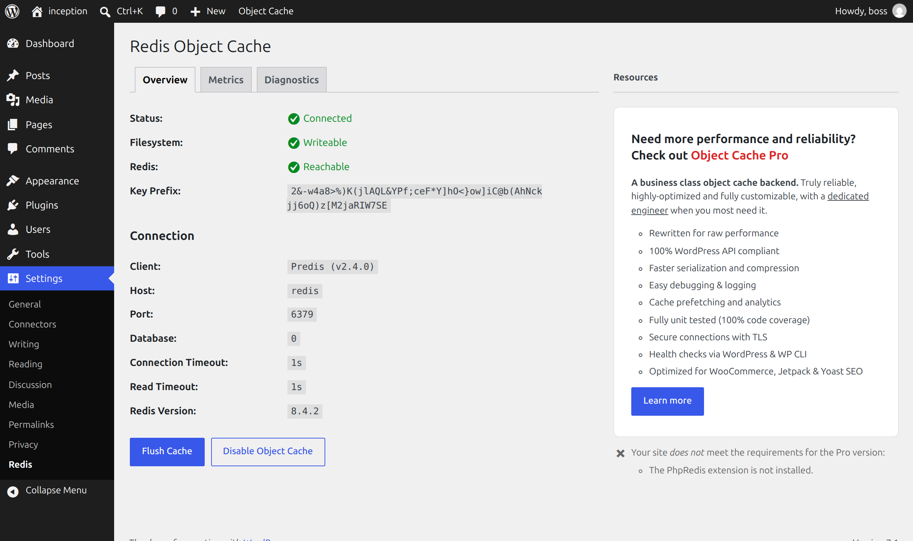
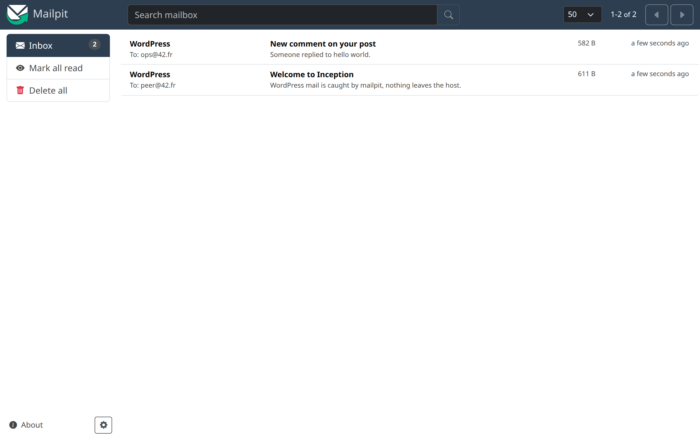
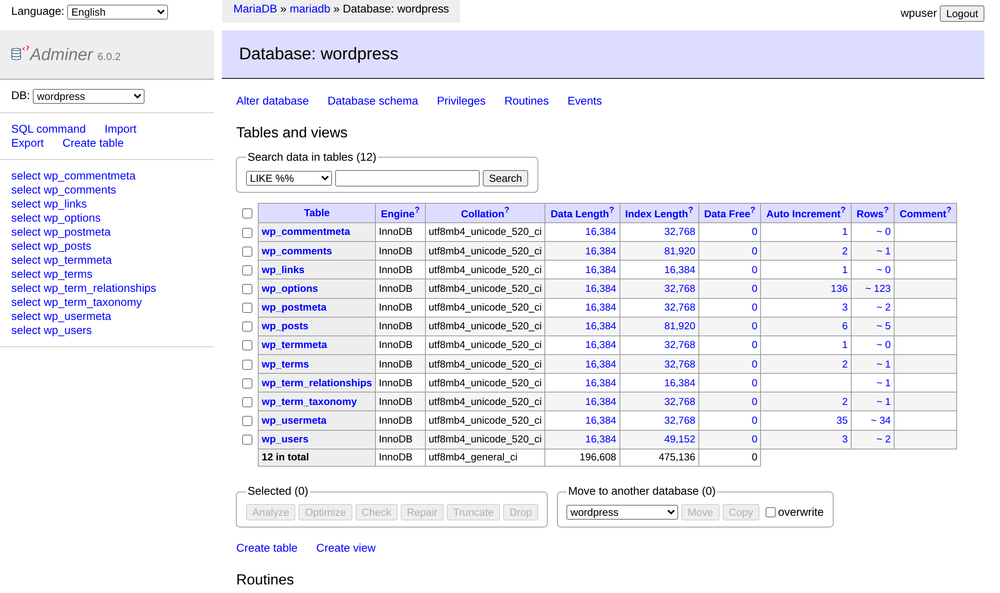
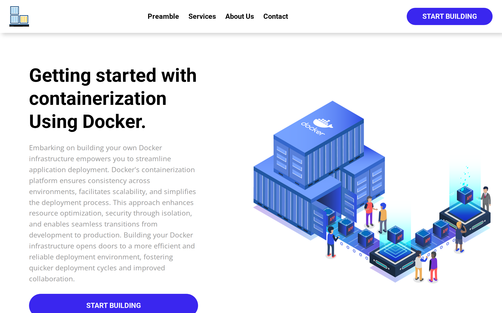

<div align="center">

# Inception

**A small production-shaped web infrastructure, every image built from scratch on Alpine.**

nginx with TLS 1.2/1.3 only in front, WordPress on php-fpm, MariaDB behind it,
and five more services around them, wired together with Docker Compose.


</div>

*This project has been created as part of the 42 curriculum by bahbibe.*

## What it is

Eight services, eight hand-written Dockerfiles, no ready-made images pulled from
Docker Hub. Every container runs one process in the foreground, gets its
configuration from the environment, and keeps its passwords in Docker secrets.



| Service | Role | Published |
|---|---|---|
| **nginx** | only entry point, TLS 1.2/1.3, self-signed cert made at start | 443 |
| **wordpress** | WordPress + php-fpm 8.4, installed by WP-CLI on first boot | internal |
| **mariadb** | database, bootstrapped once with `mariadbd --bootstrap` | internal |
| **redis** | WordPress object cache | internal |
| **ftp** | vsftpd pointing at the WordPress files | 21, 4000-4010 |
| **adminer** | database web UI | 4242 |
| **mailpit** | catches the mail WordPress sends, SMTP + web inbox | 8025 |
| **website** | static showcase site served by nginx | 1337 |

## Screenshots

| WordPress, Redis object cache connected | Mailpit catching WordPress mail |
|---|---|
|  |  |
| **Adminer on the MariaDB container** | **The static site on 1337** |
|  |  |

## Notable bits

- **Secrets, not env vars.** Passwords live in `secrets/` and are mounted at
  `/run/secrets`. `docker inspect` on any container shows no password.
- **Real PID 1.** Every setup script ends in `exec`, so the daemon receives the
  signals Docker sends and stops cleanly.
- **Idempotent startup.** MariaDB bootstraps once, WordPress installs once, the
  FTP user is created once. Restart any container at any time.
- **Healthchecks that mean something.** wordpress waits for a healthy mariadb,
  nginx waits for a healthy wordpress, so the first boot never serves a 502.
- **nginx re-resolves upstreams.** `resolver 127.0.0.11` plus a variable in
  `fastcgi_pass`, so recreating the WordPress container does not strand nginx on
  a dead IP.
- **Small images.** 283MB for all eight, after dropping the tooling the
  containers never run: 124MB for MariaDB, 40MB for WordPress.

## Quick start

Requires Docker Engine, the Compose plugin, `make` and a Linux host.

```sh
git clone git@github.com:bahbibe/inception.git && cd inception

cp srcs/.env.template srcs/.env                       # domain, user names, db name
for f in secrets/*.template; do cp "$f" "${f%.template}"; done   # then set real passwords

echo "127.0.0.1 bahbibe.42.fr" | sudo tee -a /etc/hosts

make
```

Then open <https://bahbibe.42.fr>. The certificate is self-signed, so the browser
warns once.

| Command | What it does |
|---|---|
| `make` | create the data dirs, build, start in the foreground |
| `make ps` / `make logs` | status and logs |
| `make down` | stop, keep the data |
| `make rm` | stop and delete volumes and host data |
| `make re` | full rebuild from zero |

## Layout

```
.
├── Makefile
├── secrets/                    # passwords, gitignored, templates committed
└── srcs/
    ├── .env                    # configuration, gitignored
    ├── docker-compose.yml
    └── requirements/
        ├── nginx/              # Dockerfile + conf/ + tools/
        ├── wordpress/
        ├── mariadb/
        └── bonus/
            ├── adminer/  ftp/  mailpit/  redis/  website/
```

Data lives in `/home/<LOGIN>/data`, bound into the two named volumes.

## Design notes

**Virtual machines vs Docker.** A VM emulates a whole machine and runs its own
kernel, so it is heavy and slow to boot. A container shares the host kernel and
isolates processes with namespaces and cgroups: it starts in a second and costs
far less memory, with weaker isolation in exchange.

**Secrets vs environment variables.** Environment variables show up in
`docker inspect`, in `/proc/<pid>/environ` and in every child process. Docker
secrets arrive as files under `/run/secrets`, only in the services that declare
them. Here the passwords are secrets and the rest of the configuration is `.env`.

**Docker network vs host network.** On the host network a container shares the
host stack, so every port it opens is exposed and nothing is isolated. A bridge
network gives each container its own address and a DNS name, and only the ports
listed under `ports:` reach the host.

**Volumes vs bind mounts.** A bind mount maps a host path straight in and depends
on the host layout. A named volume is managed by Docker, has a name, and can be
listed, inspected and removed with `docker volume`. The two volumes here use the
`local` driver so their contents still land in a known host folder.

## Docs

- [USER_DOC.md](USER_DOC.md) — using the stack: services, credentials, health checks
- [DEV_DOC.md](DEV_DOC.md) — setup from scratch, Makefile targets, where data lives

## Resources

- [Docker docs](https://docs.docker.com/) and the [Compose file reference](https://docs.docker.com/reference/compose-file/)
- [Dockerfile best practices](https://docs.docker.com/build/building/best-practices/)
- [nginx ssl module](https://nginx.org/en/docs/http/ngx_http_ssl_module.html)
- [mariadb-install-db](https://mariadb.com/kb/en/mariadb-install-db/)
- [WP-CLI commands](https://developer.wordpress.org/cli/commands/)
- [vsftpd manual](https://security.appspot.com/vsftpd/vsftpd_conf.html)
